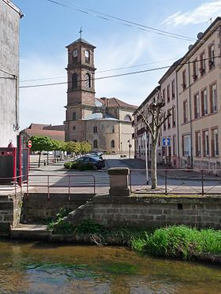

# RAON L'ETAPE

**Raon-l'Étape** est une commune française située dans le département des Vosges, en Lorraine, dans la région administrative Grand Est.

Ses habitants sont appelés les *Raonnais(es)*.

## Sommaire

- [Géographie](geographie.md)
- [Urbanisme](urbanisme.md)
- [Culture locale et patrimoine](culture-patrimoine.md)

## Articles connexes via wikipedia 

- [Croix monumentales, oratoires et chapelles de Raon-l'Étape](https://fr.wikipedia.org/wiki/Croix_monumentales,_oratoires_et_chapelles_de_Raon-l%27%C3%89tape)
- [Fontaine des Quatre Lions](https://fr.wikipedia.org/wiki/Fontaine_des_Quatre_Lions)
- [Museumotel]([Museumotel](https://fr.wikipedia.org/wiki/Museumotel))
- [Union sportive raonnaise](https://fr.wikipedia.org/wiki/Union_sportive_raonnaise)
- [Communauté d'agglomération de Saint-Dié-des-Vosges](https://fr.wikipedia.org/wiki/Communaut%C3%A9_d%27agglom%C3%A9ration_de_Saint-Di%C3%A9-des-Vosges)

