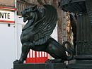
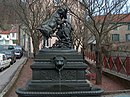
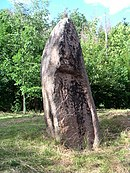
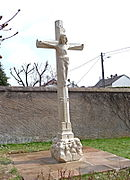

# Culture locale et patrimoine

## Lieux et monuments

- Le menhir, situé à la limite du département au lieu-dit « Pierre-Borne », est un monolithe très régulier de granit rose. Il dépasse le sol de plus de 3 mètres. Classé monument historique par décret en date du 25 novembre 1924.
- L'hôtel de ville, construit en 1733 totalement en grès rose avec des arcades, est inscrit au titre des monuments historiques par arrêté du 19 décembre 1986. Son horloge, datée de 1843, est inscrite au titre objet depuis 1991.
- Les onze fontaines du xixe siècle, installées de 1863 à 1893 et intitulées respectivement Le Bonheur, La Chèvre, Les Trois Coliches, L'Enfant et le Cygne, L'Automne, Diane de Fabies, La Pomme de Pin, La Concorde, Les Quatre Lions, Minerve et L'Enfant. Elles sont des reproductions en fonte de fer de statues célèbres sur les modèles de J.-J. Ducel réalisées soit à la fonderie Ducel à Pocé-sur-Cisse, soit à la fonderie d'Osne-le-Val et font l'objet d'une mesure de protection par inscription au titre des Monuments historiques en date du 15 septembre 1995. Les lions ailés sont en fait des griffons, animaux d'origine persane qui ont une fonction protectrice.
- Le "Oualou", statue d'un radelier (voileur).
- La croix monumentale fin xvie siècle, située au cimetière de la Haute Chapelle. Inscrite au titre des Objets mobiliers à l'inventaire supplémentaire des Monuments Historiques. (Arrêté préfectoral No 3 623/2008 du 18 novembre 2008). Rénovée fin 2009 et réimplantée à l'entrée du cimetière de la Haute-Chapelle en avril 2010.

### Quelques photos:

>Statue de lion ailé, emblème de Raon-l'Étape.

>Fontaine La Chèvre.

>Le menhir de Pierre-Borne.

>La croix classée MH rénovée en 2010.