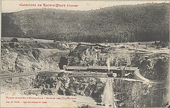
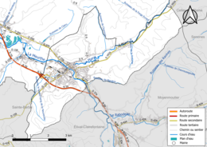

# GEOGRAPHIE

## Localisation

*Raon-l'Étape* est située au confluent de la *Meurthe* et de la *Plaine* à 285 mètres d'altitude. La ville est distante de 17 kilomètres de Saint-Dié-des-Vosges, de 44 kilomètres d'Épinal, de 69 kilomètres de Nancy et de 88 kilomètres de Strasbourg via le col du Donon. Nichée dans une vallée assez étroite, l'agglomération est dense, entourée de coteaux très boisés : la forêt occupe 59 % de la superficie communale. Première commune du département en venant de Nancy, on la surnomme la « porte des Vosges ».

## Géologie et relief

L'altitude de la mairie de Raon-l'Étape est de 300 mètres environ, la ville se situe entre 279 m et 610 m tandis que l'altitude moyenne est de 445 m environ.

Dès le xvie siècle, le granite et le trapp ont été utilisés pour les besoins locaux.

>Carrière de trapp.
Abattage du trapp (fonds photographique Ad. Weick).
Abattage du trapp
(fonds photographique Ad. Weick).

>Plans inclinés d'extraction. Garage des wagonnets (fonds photographique Ad. Weick).

La commune se trouve dans une zone de sismicité faible.

## Hydrographie

La commune est située dans le bassin versant du Rhin au sein du bassin Rhin-Meuse. Elle est drainée par la Meurthe, la Plaine, Grand Faing de Laneuveville, le ruisseau de Charmois, le ruisseau de la Forge Evrard, le ruisseau de la Trouche, le ruisseau de Mandois et le ruisseau le Grand Faing de la Neuveville.

La Meurthe, d'une longueur totale de 160,6 km, prend sa source dans la commune du Valtin et se jette dans la Moselle à Pompey, après avoir traversé 53 communes.

La Plaine, d'une longueur totale de 34,3 km, prend sa source dans la commune de Grandfontaine et se jette dans la Meurthe sur la commune, après avoir traversé onze communes.

Source de la Criquette.

Le barrage de Vieux Pré complète le réseau hydrographique.

>Réseaux hydrographique et routier de Raon-l'Étape

La qualité des eaux de baignade et des cours d’eau peut être consultée sur un site dédié géré par les agences de l’eau et l’Agence française pour la biodiversité.

## Climat

Un climat tempéré chaud est présent à Raon-l'Étape. Des précipitations importantes sont enregistrées toute l'année à Raon-l'Étape, y compris lors des mois les plus secs. D'après Köppen et Geiger, le climat y est classé Cfb. En moyenne la température à Raon-l'Étape est de 9,4 °C. Sur l'année, la précipitation moyenne est de 758 mm.

Article détaillé : [Climat du département des Vosges.](https://fr.wikipedia.org/wiki/Climat_du_d%C3%A9partement_des_Vosges)