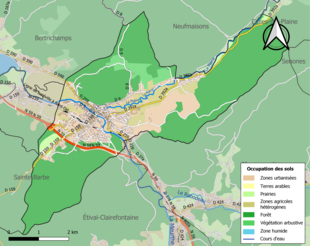

# URBANISME

## Typologie

*Raon-l'Étape* est une commune urbaine, car elle fait partie des communes denses ou de densité intermédiaire, au sens de la grille communale de densité de l'InseeNote 1,30,31,32. Elle appartient à l'unité urbaine de Raon-l'Étape, une agglomération inter-départementale regroupant 3 communes33 et 8 055 habitants en 2017, dont elle est ville-centre.

Par ailleurs la commune fait partie de l'aire d'attraction de Saint-Dié-des-Vosges, dont elle est une commune de la couronneNote 2. Cette aire, qui regroupe 47 communes, est catégorisée dans les aires de 50 000 à moins de 200 000 habitants.

Schéma de cohérence territoriale des Vosges centrales.

## Occupation des sols

L'occupation des sols de la commune, telle qu'elle ressort de la base de données européenne d’occupation biophysique des sols Corine Land Cover (CLC), est marquée par l'importance des forêts et milieux semi-naturels (67,6 % en 2018), néanmoins en diminution par rapport à 1990 (70,8 %). La répartition détaillée en 2018 est la suivante : forêts (64,1 %), zones urbanisées (14,9 %), zones agricoles hétérogènes (7 %), mines, décharges et chantiers (5,6 %), milieux à végétation arbustive et/ou herbacée (3,5 %), zones industrielles ou commerciales et réseaux de communication (2,9 %), prairies (2 %).

L'IGN met par ailleurs à disposition un outil en ligne permettant de comparer l’évolution dans le temps de l’occupation des sols de la commune (ou de territoires à des échelles différentes). Plusieurs époques sont accessibles sous forme de cartes ou photos aériennes : la carte de Cassini (xviiie siècle), la carte d'état-major (1820-1866) et la période actuelle (1950 à aujourd'hui).

*Carte des infrastructures et de l'occupation des sols de la commune en 2018.*

